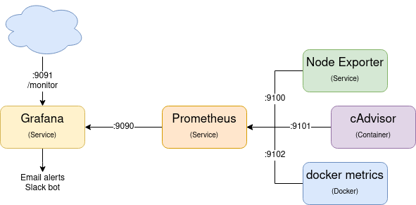

# UNCode Monitoring

To monitor some metrics of the servers where UNCode is deployed, it can be installed some tools. Those tools are [Grafana](https://grafana.com/), [Prometheus](https://prometheus.io/), [Node Exporter](https://github.com/prometheus/node_exporter), [cAdvisor](https://github.com/google/cadvisor) and [Docker Metrics](https://docs.docker.com/config/daemon/prometheus/).
## Components
The structure of the components that make possible the monitoring are shown below.  
  
Prometheus collects the data from Node Exporter, cAdvisor and Docker Metrics. Data stored in Prometheus is queried by Grafana to show the information through Dashboards or to send Alerts via [email](https://grafana.com/docs/grafana/latest/alerting/notifications/#email) or via [Slack webhook](https://grafana.com/docs/grafana/latest/alerting/notifications/#slack).
Ports are configurable. 

## Installation 
Here is explained the step by step to install the components to monitor the server. 

1. Inside the Deployment folder, make the .sh files runnable:

   ```bash
   chmod +x monitoring/*.sh
   ```
 
2. Set ENV var, modify the file `$DEPLOYMENT_PATH/monitoring/setup_monitoring_environment.sh` and run this file

3. Disable selinux

   `sudo $DEPLOYMENT_PATH/deployment_scripts/disable_selinux.sh`

   *Running this command will cause the server to restart automatically so that the changes are applied*

4. Install monitoring services `$DEPLOYMENT_PATH/monitoring/install_monitoring_services.sh`
5. Install monitoring panel `$DEPLOYMENT_PATH/monitoring/install_monitoring_panel.sh`
6. (Optional) Install nginx `$DEPLOYMENT_PATH/monitoring/deploy_nginx_server_monitoring.sh`

For other servers

1. Inside the Deployment folder, make the .sh files runnable:

   ```bash
   chmod +x monitoring/*.sh
   ```

2. Set ENV var, modify the file `$DEPLOYMENT_PATH/monitoring/setup_monitoring_environment.sh` and run this file

3. Disable selinux

   `sudo $DEPLOYMENT_PATH/deployment_scripts/disable_selinux.sh`

   *Running this command will cause the server to restart automatically so that the changes are applied*

4. Install monitoring services `$DEPLOYMENT_PATH/monitoring/install_monitoring_services.sh`
5. Install nginx `$DEPLOYMENT_PATH/monitoring/deploy_nginx_server_monitoring.sh`
6. Update prometheus config in main server

## Additional Configuration
### Graphs in the alerts
1. Install the image renderer plugin
    ```
    grafana-cli --pluginsDir \"${MONITOR_PATH}/grafana/plugins\" plugins install grafana-image-renderer
    ```
2. Install dependencies  
   Centos - RedHat
   ```
    yum install at-spi2-atk
    yum install libXScrnSaver
    yum install gtk3
   ```

### Dashboards
Two dashboards were build to show relevant information of UNCode ([General Dashboard](assets/monitoring/uncode_dashboard.json) and [Daily Reports Dashboard](assets/monitoring/uncode_reports.json)). They can be imported in Grafana after replace some fields. 
```
sed 's@SERVER_IP@'${SERVER_IP}'@g;s@GRAFANA_PORT@'${GRAFANA_PORT}'@g;s@CADVISOR_PORT@'${CADVISOR_PORT}'@g;s@DMETRICS_PORT@'${DMETRICS_PORT}'@g' ./config_files/uncode_dashboard.json > ${MONITOR_PATH}/uncode_dashboard.json
sed 's@SERVER_IP@'${SERVER_IP}'@g;s@GRAFANA_PORT@'${GRAFANA_PORT}'@g;s@CADVISOR_PORT@'${CADVISOR_PORT}'@g;s@DMETRICS_PORT@'${DMETRICS_PORT}'@g' ./config_files/uncode_reports.json > ${MONITOR_PATH}/uncode_reports.json
```
### Final Configuration
In Grafana Webpage
1. Add prometheus as data source"
2. Add dashboards Ex. 1860 or 10566
3. Add notification channels (To send alerts)
