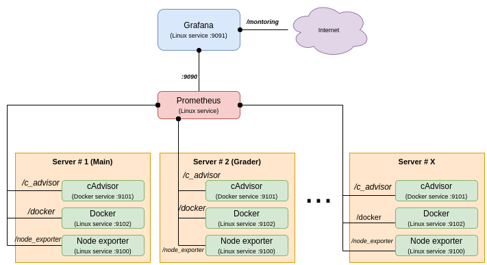

# UNCode Monitoring

To obtain some monitoring metrics from the servers where UNCode is deployed, some services can be installed. Those tools are [Grafana](https://grafana.com/), [Prometheus](https://prometheus.io/), [Node Exporter](https://github.com/prometheus/node_exporter), [cAdvisor](https://github.com/google/cadvisor) and [Docker Metrics](https://docs.docker.com/config/daemon/prometheus/).

Here is shown how these services are used and installed to collect those metrics, to have a constant monitoring over the serves and even you can send custom alerts whenever something is not right.

## Components
The structure of the components that make possible the monitoring are shown below.  



Prometheus collects the data from Node Exporter, cAdvisor and Docker Metrics services. These three services are deployed in all servers that you want to monitor and collect metrics from, for instance, grader or tools hosts.
Prometheus will be deployed in the main server, and this will be configured to collect the metrics from all servers. Grafana is the service which faces internet and will be only accessible to admin users in the path `/monitoring`. Grafana shows the information from Prometheus through Dashboards, where you can also send Alerts via [email](https://grafana.com/docs/grafana/latest/alerting/notifications/#email) or via [Slack webhook](https://grafana.com/docs/grafana/latest/alerting/notifications/#slack).
Thus, you will have to install only some few services to monitor additional server whenever you add new ones to the infrastructure.

## Installation

As per the the previous figure, you will first install the services which collect metrics, then, you will install Grafana and Prometheus in the main server, doing the corresponding configurations to start monitoring your servers.

### Install metrics services

Here is explained the step by step to install the components to monitor the server. For this tutorial, we suppose you already cloned the repository and have done some kind of installation, either grader, tools or the whole application within this server.

1. Inside the Deployment folder, make the .sh files runnable:

   ```bash
   chmod +x monitoring/*.sh
   ```

2. Modify the environmental variable `MONITOR_PATH` with the path where you want to install the monitoring services. To do so, modify the file `$DEPLOYMENT_HOME/monitoring/setup_monitoring_environment.sh`.

3. Run the command `$DEPLOYMENT_HOME/monitoring/setup_monitoring_environment.sh` to set the environment variables.

4. Disable selinux

   `sudo $DEPLOYMENT_HOME/deployment_scripts/disable_selinux.sh`

   *Running this command will cause the server to restart automatically so that the changes are applied*

5. Install the monitoring services `$DEPLOYMENT_HOME/monitoring/install_monitoring_services.sh`

6. There two options, this dependes whether nginx is already installed or not:

    - In case Nginx is not used in this server, install nginx reverse proxy: `$DEPLOYMENT_HOME/monitoring/deploy_nginx_server_monitoring.sh`
    
    - In case the reverse proxy is already installed and used in this server, add the next rules to the configuration file located in `/etc/nginx/conf.d/`:
    
    ```
    location /node_exporter/ {
        proxy_pass http://localhost:9100/;
    }

    location /c_advisor/ {
        proxy_pass http://localhost:9101/;
    }

    location /docker/ {
        proxy_pass http://localhost:9102/;
    }
    ```
    
    Restart nginx: `sudo service nginx restart`.
    
7. Update prometheus configuration file in the **main server** in `$MONITOR_PATH/prometheus/prometheus.yml` under the `scrape_configs` option (in case you have not installed Grafana and prometheus, see the next subsection and come back here to see how to add a server to prometheus).
Here you have to add a new target for the different jobs in prometheus (node-exporter, docker, c-advisor), where a target is the IP of this server. Additionally, set a label to this IP so you can query the metrics of this server from grafana using the given label.
Here is shown a example of how to add this target to the file, where the target with IP `35.226.138.8` is added to prometheus, so this server can be queried.

```yaml
- job_name: 'node-exporter'
metrics_path: "/node_exporter/metrics"
static_configs:
  - targets: ['168.1.x.x'] # This is the IP of the main server
    labels:
      instance: 'main'
  - targets: ['35.226.138.8'] # Another target in case you want to monitor another server, for example another grader or the tools server.
    labels:
      instance: 'grader-1'# Change label
- job_name: 'c-advisor'
metrics_path: /c_advisor/metrics
static_configs:
  - targets: ['168.1.x.x'] # This is the IP of the main server
    labels:
      instance: 'main'
  - targets: ['35.226.138.8'] # Add the remote server you want to monitor
  labels:
      instance: 'grader-1' # Change label
- job_name: 'docker'
metrics_path: /docker/metrics
static_configs:
  - targets: ['168.1.x.x'] # This is the IP of the main server
    labels:
      instance: 'main'
  - targets: ['35.226.138.8'] # Add the remote server you want to monitor
  labels:
      instance: 'grader-1' # Change label
```

After that, restart prometheus to load changes: `sudo service prometheus restart`.

8. In case this is the main server, follow next steps

### Install control panel and prometheus

Follow these steps only in the main server, which already contains the front end and the main services.

1. Modify the var `GRAFANA_DOMAIN` in the file `$DEPLOYMENT_HOME/monitoring/grafana/install_grafana.sh` with the domain where grafana is hosted.

2. Install monitoring panel: `$DEPLOYMENT_HOME/monitoring/install_monitoring_panel.sh`

3. Update nginx configuration file to be able to access grafana in the path `/monitoring`.

    ```
    location /monitoring/ {
      proxy_pass http://localhost:9091;
    }
    ```

4. Restart nginx: `sudo service nginx restart`.

## Additional settings

Here are some additional (optional) settings you can add to Grafana in order to improve the monitoring experience. 

### Alerts via Email

In case you want to configure Grafana to alert via email, follow next steps:

1. Install grafana plugin:
   
   ```bash
   grafana-cli --pluginsDir \"${MONITOR_PATH}/grafana/plugins\" plugins install grafana-image-renderer
   ```

2. Install dependencies:
 	
 	```bash
 	yum install at-spi2-atk
 	yum install libXScrnSaver
 	yum install gtk3
 	```

3. Configure grafana.ini (SMTP) and restart Grafana service

	```bash
	sudo systemctl restart grafana-server
	```

### Graphs in the alerts

1. Install the image renderer plugin
    
    ```bash
    grafana-cli --pluginsDir \"${MONITOR_PATH}/grafana/plugins\" plugins install grafana-image-renderer
    ```

2. Install dependencies  
   ```bash
    yum install at-spi2-atk
    yum install libXScrnSaver
    yum install gtk3
   ```

### Add dashboards

Two dashboards were built to show relevant information of UNCode ([General Dashboard](monitoring/grafana/uncode_dashboard.json) and [Daily Reports Dashboard](monitoring/grafana/uncode_reports.json)). 
Download these files, and import them. After that, start modifying each dashboard to update the queries with the correct targets you want to monitor. 

### Final Configuration in Grafana

In Grafana Webpage

1. Add prometheus as data source

2. Add dashboards Ex. 1860 or 10566

3. Add notification channels (To send alerts)
